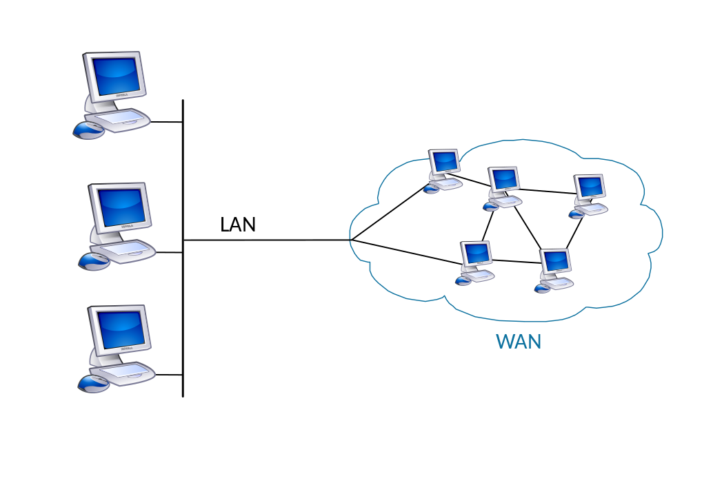
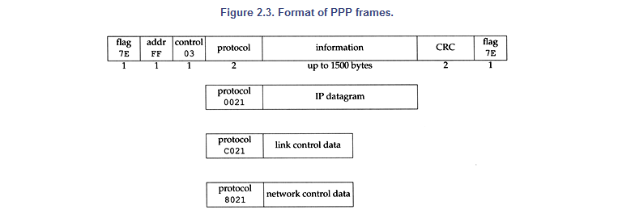
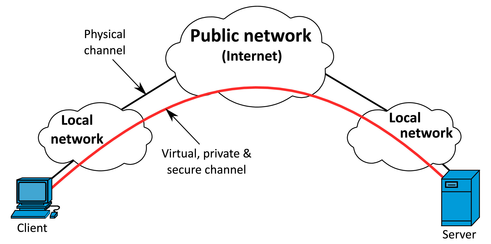
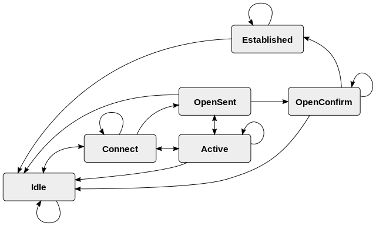
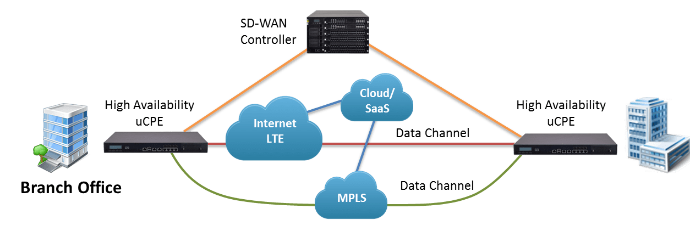

# Tecnologías WAN

## Contenidos:

1. **Tecnologías WAN: Descripción general.** 
2. **Conexiones punto a punto.**
 * **Descripción general de punto a punto serie.** 
 * **Operación de PPP.** 
 * **Implementación de PPP.**
3. **Conexiones de sucursal.** 
 * **Conexiones de acceso remoto.** 
 * **PPPoE.**
 * **VPN.** 
 * **GRE.** 
 * **BGP.** 
4. **Redes WAN híbridas.**
5. **Glosario.** 
6. **Bibliografía**

## 1. Tecnologías WAN: Descripción general. 

**La WAN en definitiva es una red mas amplia que una LAN, red local, el mejor ejemplo de ello es internet. Detrás de internet nos podemos remontar al origen como tal de ARPAnet, el proyecto de ARPA, implicaba la conexión a través de distintos nodos ubicados en puntos geográficamente alejados. La idea central de esta red era conseguir que la información llegara a su destino aunque parte de la red estuviera destruida.
De esta manera, paulatinamente se alcanzaría la conexión entre las LAN, conforme se abrió al resto de organizaciones y en definitiva a los ciudadanos, se llegaría al internet tal y cómo lo conocemos.**

**Con el tiempo y con la ampliación de su uso, se necesitó una organización capaz de crear unos estándares y protocolos para permitir una mejor interconexión entre distintos dispositivos, para ello surgió la ISO.**

**Junto a ello, diversas empresas (ISP) empezarón a crear su propia infraestructura de red, y con ello llevar la teconología a los hogares, para ello ampliando los nodos de interconexión en la WAN global que es internet.** 

**Como tal, han ido evolucionando de manera que contamos con diversas tecnologías que han sido las encargadas de permitir las distintas conexiones mediante distintos dispositivos o redes. Algunas de ellas son:**

Tecnología | Características
------------ | -------------
IP/MPLS | Técnica de superposición diseñada para simplificar mediante la conmutación de paquetes usando algunas carácteristicas de redes no orientadas a la conexión.
PDH | Primer estandar de transmisión digital el cual multiplexa las señales, se propuso como una manera de unificar la tecnología en todo el mundo.
SDH | Derivado del SDH, esta nueva tecnología síncrona mejoraría las debilidades de su antecesor, especificando velocidaides de transmisión, el formato, o el mismo funcionamiento de los equipos.
SONET | Estandar para multiplexar tráfico digital, similar al SDH pero usado en Norteamérica. 
ATM | Se utilizó sobre la red troncal SONET/SDH, de forma asíncrona, se diseñó para gestionar tráfico de datos y voz y video de baja latencia. 
X.25 | Recomendación actuan en deshuso, define niveles de capa física, datos y red. Es una interfaz entre los terminales de datos y sus destinos. Funcionan como paquetes.

**En paralelo ha sido necesario la inclusión de distintas tecnologías para poder llevar la carga de multitud de nuevos dispositivos conectados.
En referencia a la topología de las wan, estas se organizan de la siguiente manera:**

**Red punto a punto: Cada nodo se conecta con los demás a través de circuitos dedicados, que siempre están disponibles para la comunicación entre dos puntos.**

**Red en estrella: Un nodo central sirve de nexo para comunicar todos los demás nodos de la subred entre sí.**

**Malla completa: Los diversos nodos se conectan a cualquier otro directamente sin pasar por un hub central.**

**Topología de seguridad preventiva doble: Red que implementa la rebundancia entre las distintas conexiones, la más costosa.**

-------------------------------------------
## 2. Conexiones punto a punto.
* **Descripción general de punto a punto serie.** 

**La tecnología PPP es un protocolo de la capa de enlace propuesto por la IETF en 1989. Esta se usa en los router de Cisco en sustitución de su HDLC cuando se conectan a otros router que no son Cisco ya que usan el High-Level Data Link Control (HDLC). Su principal función es la de facilitar las transmisión de paquetes entre enlaces punto a punto. Tecnología que actualmente adoptan los ISPs del mundo para proveer acceso a internet.**

 * **Operación de PPP.** 
 
 **Con un sector tecnológico en auge, la proliferación de tecnologías de diversos frabricantes han hecho necesaria la implantación de divertas formas comunes de comunicación. De ahí el orgen de PPP, el cual se planteó como un protocolo que tendría que ser compatible para el hardware. Este se organiza de manera que en el modelo OSI ocupa dos capas, por una parte, la capa de red y por otra, encapsula otros protocolos de la capa de enlace.**
 
 
 
 **PP encapsula en tramas de 6 campos que permiten intercambiar la información tras usar los distintos pasos.**
 
 **PPP usa el Link Control Protocol (LCP) para establecer una sesión entre el ordenador del usuario y el ISP que le ofrece servicios de conexión. Los paquetes LCP intercambian la información entre los distintos enlaces para determinar carácteristicas como la identidad de los distintos dispositivos o el tamaño del paquete.**
 

 
 * **Implementación de PPP.**
 
 **Otro de los componentes fundamentales de las conexiones punto a punto son los Authentication Protocols (AP), estos se dan de distintas formas, por una parte el protocolo Password Authentication Protocol (PAP), este es un protocolo de verificación de acceso mediante usuario y contraseña, no obstante no es el más seguro ya que las contraseñas no están cifradas.** 

**Por otra parte, existe el Challenge Handshake Authentication Protocol (CHAP), este protocolo utiliza un número aleatorio del servidor que es enviado al ordenador del usuario, este encripta la contraseña con ese valor y se lo devuelve al servidor.
Existen otros métodos de autentificación para otros tipos de conexiones inhalambricas como el EAP.**

## 3. Conexiones de sucursal. 
**Hoy en día las empresas que se situan en lugares geográficamente distintos necesitan una manera de compartir recursos en una situación similar a las LAN, de ahí que muchas empresas tengan su red WAN privada en la que usuarios de distintos continentes pueden estar en contacto directo.
No obstante, el hecho de usar conexiones a través de las infraestructuras existentes, el internet público que conocemos, ha hecho descubrir necesidades nuevas que van desde la misma conexión a la seguridad. Para ello, hay diversas tecnologías que podemos usar.**

* **Conexiones de acceso remoto.** 
 **Un clásico hoy en día como las conexiones de acceso remoto, permiten la conexión a otro ordenador a través de internet, de esta manera se pueden solucionar problemas sin tener que acceder a la ubicación del ordenador remoto.**
 
 * **PPPoE.**
 **Este protocolo consigue unir Ethernet con el protocolo PPP, de ahí que se encapsula en este protocolo para no perder los beneficios de ambos.**
 
 * **VPN.** 
 **Con una mayor relevancia de las conexiones remotas desde cualquier lado, para preservar la seguridad, se creó este protocolo el cual permite la encriptación al igual que la privacidad.**
 

 
 * **GRE.** 
 **El protocolo GRE (Generic Routing Encapsulation) sigue un poco la filosofía del VPN, permite "tunelizar" los paquetes a través de internet, posibilitando así su anonimato.**
 
 * **BGP.** 
 **Este protocolo se usa para intercambiar información entre routers y así rellenar sus tablas, se suele usar principalmente el eBGP, es decir, externo entre ISPs para tener la información necesaria para enrouter las distintas tramas de datos aunque existe la versión iBGP para redes internas.**
  
 
## 4. Redes WAN híbridas.
**Actualmente las empresas están migrando sus datos de sus servidores locales a la nube, es una realidad, ahí es cuando entra la red híbrida. La red híbrida mantiene las conexiones MPLS más tradicionales para el tráfico esencial, no obstante, hay muchas situaciones en las que no es necesario una red WAN privada mucho más costosa. De ahí surge SD-WAN, una manera de administrar la red por software.
La idea se centra en que hay muchas tareas no esenciales que pueden funcionar a través de Internet aunque implique menos confiabilidad.**

**Esta tecnología reciente, funciona creando una especie de red virtualizada en la que la configuración y monitorización pasan a estar en un software y no en el hardware físico. No solo es más sencilla de implementar, ya que se obvian los costos de ir manualmente a congfigurar los dispositivos, si no que se puede tener un control más claro de forma centralizada. Esto no implica que el tráfico esencial deje de usar conexiones punto a punto, pero hay un ahorro significativo en la carga de la red al usar infraestructuras públicas.**

 
## 5. Glosario. 
**WAN:** Wide Area Network, Red de Área Amplia.

**ARPA:** Advanced Research Projects Agency, Agencia de Proyectos de Investigación Avanzados.

**ISO:** International Organization for Standardization, organización internacional dedicada a la supervisión y creación de protocolos, y estandar de tecnologías. 

**ISP:** El proveedor de servicios de Internet, (ISP, por las siglas en inglés de Internet service provider) es la empresa que brinda conexión a Internet a sus clientes.

**PPP:** Protocolo de conexión punto a punto.

**LCP:** Link Control Protocol, forma parte de las conexiones punto a punto, se encarga de preparar las comunicaciones mediante envios de paquetes LCP para establecer la tramisión de datos.

**AP:** Protocolo de autenticación.

**PAP:** Protocolo de autentificación por contraseña.

**CHAP:** Protocolo de autentificación por Handshake(Establecimiento de conexión).

**HDLC:** Protocolo de capa de enlace usado por Cisco que encapsula tramas de datos.

## 6. Bibliografía
NODO50 [Introducción a Internet](https://www.nodo50.org/manuales/internet/1.htm) [Consulta 10 de Abril de 2020]

Definicion.de [Definicion de WAN](https://definicion.de/wan/) [Consulta 10 de Abril de 2020]

Wikipedia [Proveedor de servicios de internet](https://es.wikipedia.org/wiki/Proveedor_de_servicios_de_Internet) [Consulta 10 de Abril de 2020]

EcuRed [Red de área extensa (WAN)](https://www.ecured.cu/Red_de_%C3%A1rea_extensa_(WAN)) [Consulta 19 de Abril de 2020]

Tutorialspoint [Conexion punto a punto](https://www.tutorialspoint.com/point-to-point-protocol-ppp) [Consulta 20 de Abril de 2020]

Whatismyipaddress [Conexion punto a punto](https://whatismyipaddress.com/ppp-pppoe) [Consulta 20 de Abril de 2020]

Wikipedia [Link Control Protocol](https://en.wikipedia.org/wiki/Link_Control_Protocol) [Consulta 20 de Abril de 2020]

Wikipedia [High-Data Link Control](https://en.wikipedia.org/wiki/High-Level_Data_Link_Control) [Consulta 21 de Abril de 2020]

Ionos [Los tipos de redes más conocidos](https://www.ionos.es/digitalguide/servidores/know-how/los-tipos-de-redes-mas-conocidos/) [Consulta 22 de Abril de 2020]

Ramonmillan [Qué es... MPLS](https://www.ramonmillan.com/tutoriales/mpls.php) [Consulta 22 de Abril de 2020]

Ramonmillan [SDH Y PDH](https://www.ramonmillan.com/tutoriales/mpls.php) [Consulta 22 de Abril de 2020]

Cisco [A Brief Overview of SONET Technology](https://www.cisco.com/c/en/us/support/docs/optical/synchronous-optical-network-sonet/13567-sonet-tech-tips.html) [Consulta 22 de Abril de 2020]

Wikipedia [Estandar ATM](https://es.wikipedia.org/wiki/Modo_de_transferencia_as%C3%ADncrona) [Consulta 22 de Abril de 2020]

IBM [Redes X.25](https://www.ibm.com/support/knowledgecenter/es/ssw_ibm_i_72/rzajt/rzajtx25con.htm) [Consulta 22 de Abril de 2020]

ADSLzone [¿Qué es PPPoE y PPPoA?](https://www.adslzone.net/adsl_pppoe.html) [Consulta 24 de Abril de 2020]

Wikipedia [GRE](https://es.wikipedia.org/wiki/GRE) [Consulta 24 de Abril de 2020]

Wikipedia [BGP](https://es.wikipedia.org/wiki/Border_Gateway_Protocol)[Consulta 24 de Abril de 2020]

Parada Visual [¿Qué es SD-WAN definida por software?](https://www.paradavisual.com/que-es-sd-wan-definida-por-software/)[Consulta 24 de Abril de 2020]

Sdxcentral [What is SD-WAN (Software-Defined Wide-Area Network)?](https://www.sdxcentral.com/networking/sd-wan/definitions/software-defined-sdn-wan/)[Consulta 24 de Abril de 2020]
